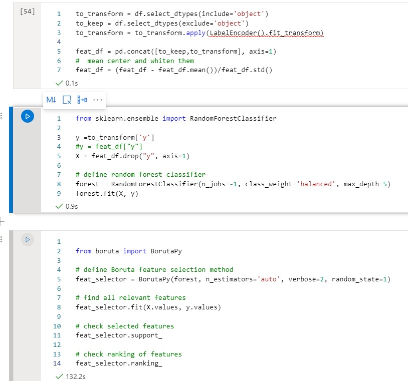
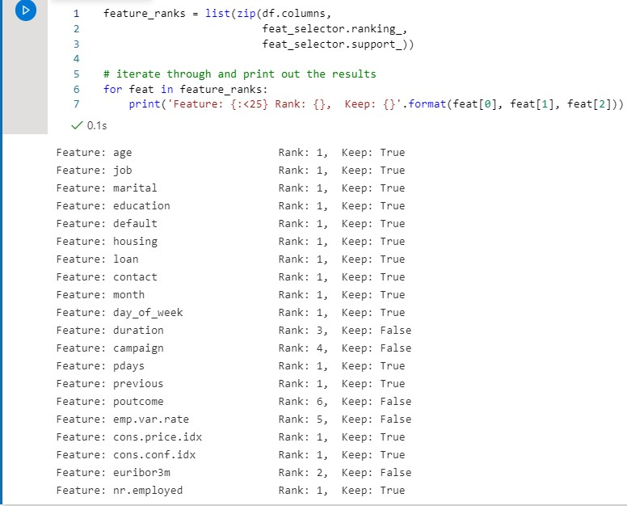
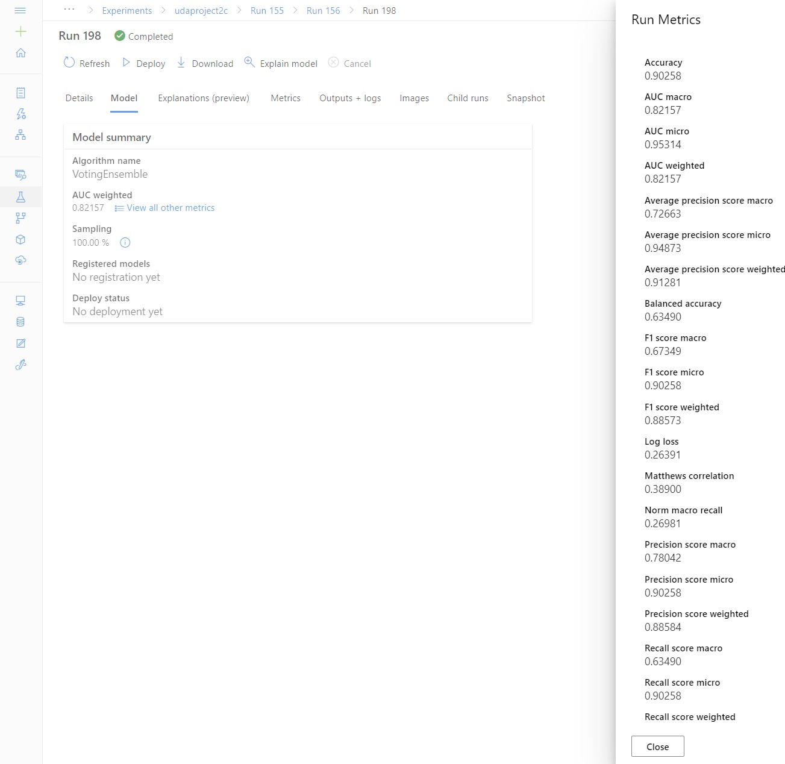

*NOTE:* This file is a template that you can use to create the README for your project. The *TODO* comments below will highlight the information you should be sure to include.

# Your Project Title Here

*TODO:* Write an overview to your project.
In this project I created an AutoML model for the bankmarketing dataset. The best model found by AutoML is deployed as a service that 
provides REST API for predicting new data samples. This REST API is then document using swagger.

Second part of the project consists of building a training pipeline to automate the process. The Pipeline will also have a REST endpoint
that can be used to launch the pipeline.

## Architectural Diagram
*TODO*: Provide an architectual diagram of the project and give an introduction of each step. An architectural diagram is an image that helps visualize 
the flow of operations from start to finish. 

In this case, it has to be related to the completed project, with its various stages that are critical to the overall flow. For example, one stage for managing models could be "using Automated ML to determine the best model". 

## Key Steps
*TODO*: Write a short discription of the key steps. Remeber to include all the screenshots required to demonstrate key steps. 

The full process includes the following 7 stages (see also the architectural diagram) :
1. Authentication
   * The authentication uses Azure AD service principal. This involves two main steps:
     * Creating the Service Principal:
       
        
       
       (NOTE: I inked over some of the IDs as sharing the on github seemed a risk.)
     * Giving the SP access to the Workspace:
       
       
    
2. Automated ML Experiment 
   
   The model was trained using Azure AutoML service. First, however, the data was loaded into
   Azure blobstorage, and a tabular dataset was created referencing the bank marketing data:
   
   
   
   After importing the data, the actual AutoML run was executed. The VotingEnsemble model performed
   best, achieving 92% classification accuracy.

   
   
3. Deploy the best model
   The learned AutoML model was then deployed into an ACI that could be accessed via the REST
   API
   
   
   
4. Enable logging
   The Application Insights were enabled to perform logging:
   
   
   
   
5. Swagger Documentation
   
   After the model endpoint was deployed, I documented the REST API with Swagger:
   
   

6. Consume model endpoints 
   
   I could then use the model via the endpoint using the Python SDK:
   
   

7.Create and publish a pipeline

   Then the whole process was wrapped into a pipeline:

   

   That was the published:
   
   

## Screen Recording
*TODO* Provide a link to a screen recording of the project in action. Remember that the screencast should demonstrate:
The screencast can be found here:
https://youtu.be/XLlHat3JGvA

##  Items added per request of the reviewer
### Ideas how to improve the model
One idea to improve the AutoML model is to do manual feature selection. To try this out,
I used The Boruta library, as suggested by the reviewer. To be able to use the Boruta,
I had to do some basic data pre-processing step manually, such as converting the categorical
(string) features into numeric labels. You can see the steps in the screenshot below (some of the
Boruta code was copied from the link the reviewer provided: (https://towardsdatascience.com/simple-example-using-boruta-feature-selection-in-python-8b96925d5d7a )

After the Boruta finished, it gave me a list of features to remove from the model:

I then went and created a new version of the dataset in the AzureML studio, removing these features from 
the schema, and reran the pipeline with the new dataset. The new model performed a lot worse than the 
original one:

Thus it might be necessary to modify the manual feature selection process. Now I did not have 
much time so I just label encoded everything and then standardized the features before 
feeding them into the feature selection algorithm.

### requested images:
Here is the pipeline endpoint

and here is the image for the widget..

